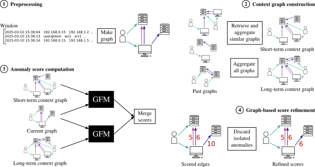

_For the code related to the ESANN '24 paper "Inductive lateral movement
detection in enterprise computer networks", switch to the `esann24`
branch._

# Designing a Reliable Lateral Movement Detector Using a Graph Foundation Model

This repository contains the code associated with our paper
"Designing a reliable lateral movement detector using a graph foundation model".
It is based on a fork from the
[ULTRA](https://github.com/DeepGraphLearning/ULTRA) project, which we
use for lateral movement detection in our work.
We added modules and scripts enabling reproduction of the
experiments presented in the paper.

### Contents

The code used in our experiments is located in the `src/` directory:

* `extract_optc.py` implements the preprocessing of the OpTC dataset;
* `extract_lanl.py` implements the preprocessing of the LANL dataset;
* `model.py` implements our lateral movement detector UltraLMD++;
* `graph.py` implements a helper class for handling graph-structured data;
* `run_experiment.py` performs anomaly scoring on a given dataset.

The event IDs of lateral movement events in the OpTC dataset were labeled
manually and can be found in the `optc_redteam.csv` file.

Finally, the tables and figures describing our results are reproduced in the
`results.ipynb` notebook.

### Usage

The `experiments.sh` script reproduces all the steps in our experiments
on UltraLMD++, from data preprocessing to lateral movement detection.
It relies on the dependencies listed in `requirements.txt`.

The raw datasets can be obtained by following these links:
[LANL](https://csr.lanl.gov/data/cyber1/),
[OpTC](https://github.com/FiveDirections/OpTC-data).
Their locations should be modified accordingly in the first two lines of
`experiments.sh`.

Results for the baseline method Argus were obtained using the code published
by the authors, which can be found [here](https://github.com/C0ldstudy/Argus).
